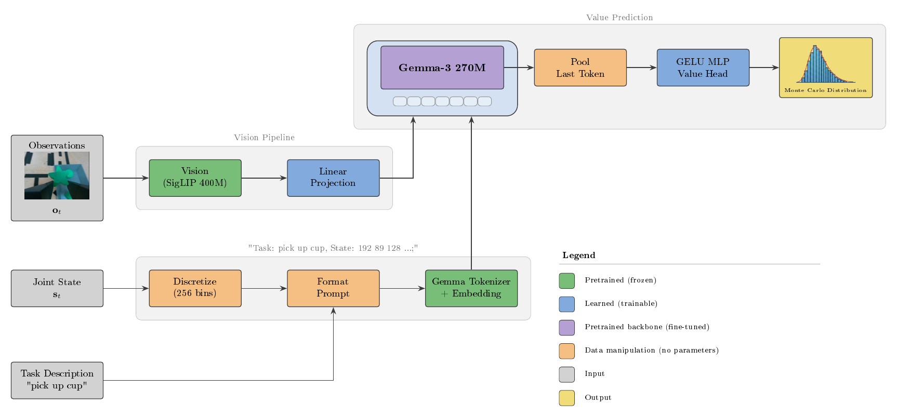

# Open Value Estimator

A standalone implementation of the value estimator architecture from Physical Intelligence's [π₀.₆*](https://www.physicalintelligence.company/blog/pi05) paper, built on SigLIP and Gemma. This model aligns predicted value with a normalized estimate of the number of steps until completion. 

It takes multi-view camera images and joint angles as input and outputs a distributional value prediction that represents the value estimate of the current state.

This value function can then be used downstream for RL and advantage conditioning of robot learning policies. 


## Motivation

Value functions are a core primitive in reinforcement learning for two reasons. First, they address the **credit assignment** problem: in robotic manipulation  for example, where rewards are delayed or sparse (the task either succeeds or fails at the end, but assigning partial credit is challenging), a value function distributes the credit of a future reward backward to the states and actions that actually caused it. Second, they provide **stability through variance reduction**: by comparing an action's actual outcome against the expected value of a state, an agent's learning can be more stable.

The π₀.₆* paper implements a value function to perform **advantage estimation**, which is then used for **advantage conditioning** on the VLA policy model. Per-task percentile thresholds binarize the advantage signal, and the policy is fine-tuned conditioned on whether each timestep is classified as positive or negative advantage. This allows inference-time 'sharpening' to steer the policy toward generating high-advantage trajectories.

This repo provides an open-source implementation of a VLM-based value estimator based on π₀.₆*, with some customized details, that can be trained on your own robot demonstration datasets for advantage estimation and integrated into downstream policy training and conditioning pipelines.

## Architecture

The model processes multi-camera images, joint angles, and a task description to produce a distributional value prediction:



**Key Components:**

1. **SigLIP Vision Encoder (400M)**: Encodes each camera view into patch embeddings. A learned linear projection maps these to the Gemma token dimension, producing a sequence of visual tokens per camera.

2. **Gemma-3 270M Backbone**: Processes the concatenated sequence of visual tokens and text tokens with bidirectional attention. The last valid token's hidden state is used as the sequence representation.

3. **Proprioceptive State Discretization and Representation**: Joint angles (normalized to [-1, 1]) are discretized into 256 uniform bins per dimension and encoded as a plain-text string of bin indices (e.g., `"192 89 128 249 0 140 224"`). This is combined with the task description into a single prompt (`"Task: ..., State: ...;"`) and tokenized through the standard Gemma tokenizer. This follows the same implementation pattern as π₀.₅.

4. **Distributional Value Head**: A GELU MLP that maps the pooled hidden state to logits over 201 bins spanning `[-1.0, 0.0]`, trained against Monte Carlo return targets via cross-entropy loss. The expected value is recovered as the softmax-weighted sum of bin centers:

   ```math
   \mathbb{E}[V] = \sum_i p_i \, c_i
   ```

   Predicting a full distribution rather than a scalar has been found to produce more stable training.
   
## Installation

**Requirements:** Python 3.10+ and [uv](https://docs.astral.sh/uv/)

```bash
git clone https://github.com/yourorg/open-value-estimator.git
cd open-value-estimator
uv sync
```

Additionally, I have added a small set of optional dependencies for training on GCP Vertex AI nodes, which you can find more details about in [cloud](./docs/cloud.md).
If you utilize GCP resources for training, you can install the optional cloud dependencies:

```bash
uv sync --extra cloud
```

For additional notes on cloud setup and usage, see: [docs/cloud.md](docs/cloud.md).

### Environment Variables

| Variable | Required | Description |
|---|---|---|
| `HF_TOKEN` | Yes | Hugging Face token for gated model access. Gemma-3 requires you to accept its license agreement on Hugging Face before downloading. Visit the [Gemma-3 270M base model page](https://huggingface.co/google/gemma-3-270m) to accept, then provide your token. Get one at [huggingface.co/settings/tokens](https://huggingface.co/settings/tokens). You may also need it if you have your LeRobotDatasets stored in their cloud. |
| `WANDB_API_KEY` | Optional | Weights & Biases API key for experiment tracking. Get one at [wandb.ai/authorize](https://wandb.ai/authorize). |

```bash
export HF_TOKEN=your_huggingface_token
export WANDB_API_KEY=your_wandb_key
```

## Quick Start

### Dataset

This library expects a [LeRobot](https://github.com/huggingface/lerobot) dataset with the following additional fields beyond the standard schema:

| Field | Type | Per-Frame | Description |
|---|---|---|---|
| `reward` | `float32` | Yes | Reward signal at each timestep. Format depends on the reward mode (see below). |
| `is_done` | `bool` | Yes | `true` on the final frame of each episode, `false` on all other frames. Used by LeRobot for episode boundary detection. |

These fields are not recorded during standard LeRobot demonstrations. To label an existing dataset with reward and done signals, you can either write your own labeling script, or see a separate repo that I've made for this exact purpose of labeling  [lerobot-labeler](https://github.com/brysonjones/lerobot-labeler).


Whichever method you choose, the convention we are following for reward labels is the "step-penalty" strategy described in the π₀.₆* paper, where per-step rewards are defined as:

$$r_t = \begin{cases} 0 & \text{if } t = T \text{ and success} \\ -C_{\text{fail}} & \text{if } t = T \text{ and failure} \\ -1 & \text{otherwise} \end{cases}$$

where $C_{\text{fail}}$ is a configurable failure penalty (`data.fail_penalty`). The undiscounted cumulative return $R_t = \sum_{k=t}^{T} r_k$ is then normalized per-task to the range $(-1, 0)$.

It's possible that other strategies could work well with this value estimation formulation, but they have not been tested, and you should proceed at your own risk.

The model interface supports the following two types of labeled dataset formats:

#### Sparse Terminal Reward Mode (default)
Set this in your config:
```yaml
data:
  precomputed_rewards: false
```

Only the sign of the **last frame's** (`t = T`) `reward` is used: positive means success, negative means failure. Intermediate reward values are ignored; the library constructs the reward signal above internally from the terminal outcome, and then subsequently calculates the value target for each frame.

If you already have binary reward labels, using this works out of the box.

#### Dense Reward Mode
Set this in your config:
```yaml
data:
  precomputed_rewards: true
```

Use this mode when per-step rewards in the dataset are already correctly set (e.g. following the format described above). The library reads the `reward` column directly at every timestep and computes backward cumulative returns and per-task normalization from those values. The `data.fail_penalty` setting is ignored in this mode since the penalty is already reflected in the reward values.

### Training

Training is launched from a YAML config file. You must provide `config=...`, and `run_name` must be set either in that file or as a CLI override:

```bash
uv run python -m open_value_estimator.training \
  config=my/config/path/config.yaml \
  run_name=my_first_run
```

Override any config value from the command line:

```bash
uv run python -m open_value_estimator.training \
  config=my/config/path/config.yaml \
  run_name=my_first_run \
  data.batch_size=32 \
  training.learning_rate=1e-5 \
  training.num_steps=10000
```

Checkpoints and logs are saved to `./outputs/open_value_estimator/<run_name>/`.

### Resume from Checkpoint

```bash
uv run python -m open_value_estimator.training \
  config=my/config/path/config.yaml \
  run_name=my_first_run \
  training.resume_from=./outputs/open_value_estimator/my_first_run/checkpoint_2000.safetensors
```

### Inference

```python
from open_value_estimator.value_estimator import OpenValueEstimator

model = OpenValueEstimator.from_pretrained(
    "path/to/checkpoint_ema.safetensors",
    device="cuda",
)

# batch: dict with 'observation.images' [B, N, C, H, W],
#        'observation.state' [B, state_dim], and 'task' list[str]
logits = model(batch)                      # [B, 201]
values = model.get_expected_value(logits)   # [B]
```

## Configuration

All configuration is stored in YAML files and can be overridden from the command line with OmegaConf dotlist syntax. The main files are:

- **`configs/config.yaml`**: runtime defaults (model, training, data, accelerate, wandb, eval, cloud)
- **`configs/advantage.yaml`**: runtime defaults for offline advantage dataset generation
- **`config.py`**: dataclass definitions with per-field descriptions

The config is organized into groups: `model`, `training`, `data`, `advantage`, `eval`, `accelerate`, `wandb`, and `cloud`. Multi-GPU training is handled via [Accelerate](https://huggingface.co/docs/accelerate). Every launcher requires an explicit config path via `config=...`.

Cloud launchers and GCP-specific setup are documented in [docs/cloud.md](docs/cloud.md).

## W&B Sweeps

This project supports W&B hyperparameter sweeps in two ways:

- **Local sweep agent** with `open_value_estimator.sweep`
- **Distributed cloud sweep agents** documented in [docs/cloud.md](docs/cloud.md)

### Prerequisites

- Set `WANDB_API_KEY` in your environment.
- Set `HF_TOKEN` in your environment if your training setup needs it.

### Local Sweep Usage

Create a new sweep from YAML and run trials locally:

```bash
uv run python -m open_value_estimator.sweep \
  config=configs/config.yaml \
  sweep_config=configs/sweeps/lr_batch_sweep.yaml \
  count=20
```

Create a sweep without launching agents (prints the sweep ID):

```bash
uv run python -m open_value_estimator.sweep \
  config=configs/config.yaml \
  sweep_config=configs/sweeps/lr_batch_sweep.yaml \
  create_only=true
```

Join an existing sweep:

```bash
uv run python -m open_value_estimator.sweep \
  config=configs/config.yaml \
  sweep_id=<SWEEP_ID> \
  count=10
```

Optional: override W&B project for local sweeps:

```bash
uv run python -m open_value_estimator.sweep \
  config=configs/config.yaml \
  sweep_config=configs/sweeps/lr_batch_sweep.yaml \
  project=open-value-estimator \
  count=20
```

## Project Structure

```
src/open_value_estimator/
  value_estimator.py       # Model definition (SigLIP + Gemma + value head)
  training.py              # Training loop and CLI entry point
  dataset.py               # Dataset loading and preprocessing
  eval.py                  # Evaluation and video generation
  config.py                # Config dataclasses and loading utilities
  utils.py                 # Shared helpers (preprocessing, checkpointing)
  sweep.py                 # W&B sweep utilities
  cloud/
    cloud_launcher.py      # GCP Vertex AI launcher
    cloud_eval.py          # GCP Vertex AI eval launcher
    cloud_training.py      # GCP remote training entry point
configs/
  config.yaml              # Main config, including cloud settings
  eval.yaml                # Minimal eval-focused config
  sweeps/
    lr_batch_sweep.yaml    # Sweep config example
    lr_grid.yaml           # Sweep config example
```

## Implementation Details

- **Value Head**: The π₀.₆* paper does not detail the specific architecture of the value head, so we make the decision in this implementation to use an MLP with GELU activations to map the Gemma backbone's pooled hidden state to logits over the categorical value distribution bins. The depth of the MLP is configurable via `model.value_head_depth`. This architecture is very common when distilling rich hidden state information into outputs to use downstream.

- **EMA Weight Smoothing**: During training, Exponential Moving Average (EMA) maintains a slow-updating copy of the weights that filters the noise of stochastic optimization, so inference can use a more stable and typically better-generalizing model; see [Morales-Brotons et al. (2024)](https://arxiv.org/abs/2411.18704).

- **Training Metrics**: We monitor four metrics to understand value function performance:
  - **Loss** (cross-entropy): The primary training objective. Measures how well the predicted distribution over value bins matches the target bin.
  - **MAE** (mean absolute error): The average absolute difference between the expected value (`E[V] = Σ pᵢ · cᵢ`) and the Monte Carlo return target. Provides an interpretable measure of prediction accuracy in the original value scale.
  - **TD Error Magnitude** (RMSE): Root mean squared error between predictions and targets. It is more sensitive to large errors than MAE, which makes it useful for detecting whether the model struggles with outlier episodes (e.g., early failures with large negative returns).
  - **Explained Variance** (`EV = 1 - Var(residuals) / Var(targets)`): Measures what fraction of the target variance is captured by the predictions. `EV = 1.0` means perfect predictions, `EV = 0.0` means the model is no better than predicting the mean, and `EV < 0` means predictions are worse than the mean. This is the most informative metric for value functions because it is scale-invariant and directly measures whether the model distinguishes high-value from low-value states.

## Downstream Use

The entire purpose of this model pipeline is to be used for downstream integration into policies for RL. Specifically in π₀.₆*, they perform advantage conditioning, which is an approach where a policy model is trained to predict actions explicitly conditioned on their estimated advantage, which represents how much better a specific action is compared to the baseline expectation for that state. 

By training on both successful and suboptimal offline data labeled with these scores, the model learns to map actions to their relative quality, allowing it to generate expert-level behavior at inference when prompted with a high target advantage.

Below, I describe a few notes and functions that are implemented in this project, which can be used to integrate this Value Function model for advantage conditioning like what's shown in π₀.₆*.

### Advantage Estimation Pipeline:
Calculates advantage values $A^\pi(\mathbf{o}_t, \mathbf{a}_t)$ from offline trajectories and a pre-trained value function $V^\pi$. Two different advantage estimation methods are implement, as is described in π₀.₆*:

#### 1. Post-Training (N-Step Lookahead)

**Formula:**

```math
A^\pi(\mathbf{o}_t, \mathbf{a}_t) = \sum_{t'=t}^{t+N-1} r'_{t'} + V^\pi(\mathbf{o}_{t+N}) - V^\pi(\mathbf{o}_t)
```

* **Configuration:** $N = 50$
* **Execution:** Sum rewards over the $N$-step window, add the future value $V^\pi(\mathbf{o}_{t+N})$, and subtract the current value $V^\pi(\mathbf{o}_t)$.

#### 2. Pre-Training (Full Episode)

**Formula:**

```math
A^\pi(\mathbf{o}_t, \mathbf{a}_t) = \sum_{t'=t}^{T} r'_{t'} - V^\pi(\mathbf{o}_t)
```

* **Configuration:** $N = T$ (where $T$ is the terminal episode step)
* **Execution:** Calculate the empirical return from step $t$ to the episode's end, then subtract the baseline $V^\pi(\mathbf{o}_t)$.

### Offline Advantage Dataset Generation

With a small enough dataset, it may be worth calculating the advantages offline, and storing them for re-use rather than calculating them during training. This repo includes an offline dataset pipeline at `open_value_estimator.advantage` that materializes these per-timestep `advantage` values into a new LeRobot dataset output.

```bash
uv run python -m open_value_estimator.advantage \
  config=configs/advantage.yaml \
  advantage.checkpoint=outputs/open_value_estimator/my_run/checkpoint_4000.safetensors \
  advantage.output_repo_id=full_ft_dataset_w_advantage \
  advantage.mode=n_step \
  advantage.n_step=50
```

This copies the source LeRobot dataset and adds a scalar `advantage` feature for every timestep.

Per-task percentile thresholds are computed on demand from the saved `advantage` column:

```python
from lerobot.datasets.lerobot_dataset import LeRobotDataset

from open_value_estimator.advantage import compute_task_advantage_thresholds

dataset = LeRobotDataset("full_ft_dataset_w_advantage", root="./data/full_ft_dataset_w_advantage")
thresholds = compute_task_advantage_thresholds(dataset, percentile=30.0)

# thresholds is a dict[str, float]
# If you already know the exact task string:
# open_drawer_threshold = thresholds["open drawer"]
```

### Binarized Advantage

To integrate value estimates into downstream policy conditioning, use `binarize_advantages()` together with per-task percentile thresholds from `compute_task_advantage_thresholds(...)`. Each timestep's scalar advantage is compared against its task's threshold and classified as either `"Advantage: Positive"` or `"Advantage: Negative"`. These labels can then be used for advantage conditioning on a robot policy, following the approach described in the π₀.₆* paper.

```python
from lerobot.datasets.lerobot_dataset import LeRobotDataset

from open_value_estimator.advantage import (
    binarize_advantages,
    compute_task_advantage_thresholds,
)

dataset = LeRobotDataset("full_ft_dataset_w_advantage", root="./data/full_ft_dataset_w_advantage")
thresholds = compute_task_advantage_thresholds(dataset, percentile=30.0)

samples = [dataset[i] for i in range(8)]
advantages = [float(sample["advantage"]) for sample in samples]
tasks = [sample["task"] for sample in samples]
labels = binarize_advantages(advantages, thresholds, tasks)

for task, advantage, label in zip(tasks, advantages, labels, strict=False):
    print(f"{task}: advantage={advantage:.4f}, label={label}")
```

## Plans for Future Work
The next release I plan to extend this work to is downstream advantage conditioning of various robot policies, and other RL improvment pipelines. 

You can reach out directly if you want to be involved in any of this work!

## References

This implementation is based on the value estimator described in:

- **π₀.₅**: [Physical Intelligence, "π₀.₅: a Vision-Language-Action Model with Open-World Generalization" (2025)](https://arxiv.org/abs/2504.16054)
- **π₀.₆***: [Physical Intelligence, "π₀.₆*: a VLA That Learns From Experience" (2025)](https://arxiv.org/abs/2511.14759)
- **SigLIP**: [Zhai et al., "Sigmoid Loss for Language Image Pre-Training" (2023)](https://arxiv.org/abs/2303.15343)
- **Gemma 3**: [Google DeepMind, "Gemma 3 Technical Report" (2025)](https://arxiv.org/abs/2503.19786)
- **Distributional RL**: [Bellemare et al., "A Distributional Perspective on Reinforcement Learning" (2017)](https://arxiv.org/abs/1707.06887)

## License

This project is licensed under the Apache License 2.0. See the [LICENSE](LICENSE) file for details.
